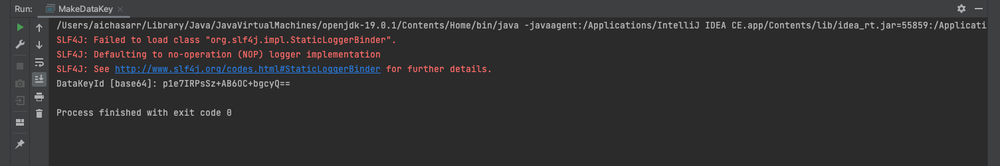
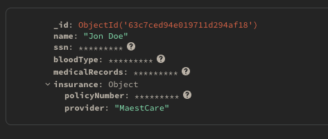
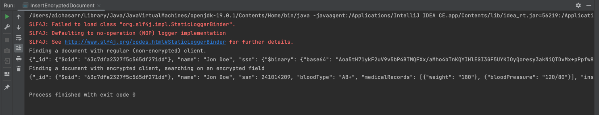

# Client-Side Field Level Encryption application with Java Spring Boot and AWS KMS

This repo shows you how to build a Client-Side Field Level Encryption (CSFLE)-enabled application using Amazon Web Services (AWS) KMS.

After you complete the steps in this guide, you should have:
- A Customer Master Key hosted on an AWS KMS instance.
- A working client application that inserts encrypted documents using your Customer Master Key.

## MongoDB Language Driver:

- Java Sync

## KMS Providers:

- Amazon Web Services Key Management Service

## Prerequisites

1. Set up the KMS

   - Log in to your [AWS Management Console](https://aws.amazon.com/console/)
   - Navigate to the [AWS KMS Console](https://aws.amazon.com/kms/)
     - Create your Customer Master Key 
     Create a new symmetric key by following the official AWS documentation on [Creating symmetric KMS keys](https://docs.aws.amazon.com/kms/latest/developerguide/create-keys.html#create-symmetric-cmk).
     The key you create is your Customer Master Key. Choose a name and description that helps you identify it; these fields do not affect the functionality or configuration of your CMK.
     In the __Usage Permissions__ step of the key generation process, apply the following default key policy that enables Identity and Access Management (IAM) policies to grant access to your Customer Master Key:
    
   ```
        {
            "Version": "2012-10-17",
            "Statement": [
                {
                    "Sid": "Enable IAM User Permissions",
                    "Effect": "Allow",
                    "Principal": {
                    "AWS": "<ARN of your AWS account principal>"
                    },
                    "Action": "kms:*",
                    "Resource": "*"
                }
            ]
        }
    ```
   *Record the Amazon Resource Name (ARN) and Region of your Customer Master Key. You will use these in later steps of this guide.*


2. Create an AWS IAM User
   - Navigate to the [AWS IAM Console](https://aws.amazon.com/iam/).
   - Create an IAM User
     Create a new programmatic IAM user in the AWS management console by following the official AWS documentation on
     [Adding a User](https://docs.aws.amazon.com/IAM/latest/UserGuide/id_users_create.html). You will use this IAM user as a service account for your CSFLE-enabled application. Your application authenticates with AWS KMS using the IAM user to encrypt and decrypt your Data Encryption Keys (DEKs) with your Customer Master Key (CMK).
   - Record your Credentials
   Ensure you record the following IAM credentials in the final step of creating your IAM user:
     - access key ID
     - secret access key
   __If you do not record these credentials during this step, you must create another IAM user.__
   - Grant Permissions
     Grant your IAM user kms:Encrypt and kms:Decrypt permissions for your remote master key.
     The following inline policy allows an IAM user to encrypt and decrypt with the Customer Master Key with the least privileges possible:

    ```
   {
        "Version": "2012-10-17",
        "Statement": [
            {
                "Effect": "Allow",
                "Action": ["kms:Decrypt", "kms:Encrypt"],
                "Resource": "<the Amazon Resource Name (ARN) of your remote master key>"
            }
        ]
        }
    ```
   - Apply the preceding policy to your IAM user, follow the [Adding IAM identity permissions](https://docs.aws.amazon.com/IAM/latest/UserGuide/access_policies_manage-attach-detach.html#add-policies-console) guide in the AWS documentation.   

3. In *YourCredentials.java* file, add your credentials (MongoDB Paths and URI, and AWS Credentials)

```
    private static Map<String, String> yourCredentials;
    static {
    yourCredentials = new HashMap<>();
    // Mongo Paths + URI
    yourCredentials.put("MONGODB_URI", "mongodb://localhost:27017");
    //yourCredentials.put("MONGOCRYPTD_PATH", "/usr/local/bin");
    yourCredentials.put("MONGOCRYPTD_URL", "mongodb://localhost:27020");
    // AWS Credentials
    yourCredentials.put("AWS_ACCESS_KEY_ID", "your_aws_access_key_id");
    yourCredentials.put("AWS_SECRET_ACCESS_KEY", "your_aws_secret_access_key");
    yourCredentials.put("AWS_KEY_REGION", "your_aws_key_region");
    yourCredentials.put("AWS_KEY_ARN", "your_aws_key_arn");
```

## Execution

1. Create a Unique Index on your Key Vault collection
In *MakeDatakey.java*, we create a unique index on the keyAltNames field in your encryption.__keyVault collection.

```
        // start-create-index
        String connectionString = credentials.get("MONGODB_URI");
        String keyVaultDb = "encryption";
        String keyVaultColl = "__keyVault";
        String keyVaultNamespace = keyVaultDb + "." + keyVaultColl;
        MongoClient keyVaultClient = MongoClients.create(connectionString);

        // Drop the Key Vault Collection in case you created this collection
        // in a previous run of this application.
        keyVaultClient.getDatabase(keyVaultDb).getCollection(keyVaultColl).drop();
        // Drop the database storing your encrypted fields as all
        // the DEKs encrypting those fields were deleted in the preceding line.
        keyVaultClient.getDatabase("medicalRecords").getCollection("patients").drop();


        MongoCollection keyVaultCollection = keyVaultClient.getDatabase(keyVaultDb).getCollection(keyVaultColl);
        IndexOptions indexOpts = new IndexOptions().partialFilterExpression(new BsonDocument("keyAltNames", new BsonDocument("$exists", new BsonBoolean(true) ))).unique(true);
        keyVaultCollection.createIndex(new BsonDocument("keyAltNames", new BsonInt32(1)), indexOpts);
        keyVaultClient.close();
        // end-create-index 
```

2. Create a New Data Encryption Key
In *MakeDatakey.java*:
    - Add your AWS KMS Credentials: we add here the service account credentials to our CSFLE-enabled client code.

    ```
       Map<String, Map<String, Object>> kmsProviders = new HashMap<String, Map<String, Object>>();
       String kmsProvider = "aws";
       Map<String, Object> providerDetails = new HashMap<>();
       providerDetails.put("accessKeyId", new BsonString("<IAM User Access Key ID>"));
       providerDetails.put("secretAccessKey", new BsonString("<IAM User Secret Access Key>"));
       kmsProviders.put(kmsProvider, providerDetails);  
    ```
   
 - Add Your Key Information: we update the following code to specify your Customer Master Key:

    ```
       masterKeyProperties.put("provider", new BsonString(kmsProvider));
       masterKeyProperties.put("key", new BsonString("<Master Key ARN>"));
       masterKeyProperties.put("region", new BsonString("<Master Key AWS Region>"));
   
    ```
   
- Generate your Data Encryption Key

```
    ClientEncryptionSettings clientEncryptionSettings = ClientEncryptionSettings.builder()
    .keyVaultMongoClientSettings(MongoClientSettings.builder()
    .applyConnectionString(new ConnectionString(connectionString))
    .build())
    .keyVaultNamespace(keyVaultNamespace)
    .kmsProviders(kmsProviders)
    .build();
    
    MongoClient regularClient = MongoClients.create(connectionString);
    
    ClientEncryption clientEncryption = ClientEncryptions.create(clientEncryptionSettings);
    BsonBinary dataKeyId = clientEncryption.createDataKey(kmsProvider, new DataKeyOptions().masterKey(masterKeyProperties));
    String base64DataKeyId = Base64.getEncoder().encodeToString(dataKeyId.getData());
    System.out.println("DataKeyId [base64]: " + base64DataKeyId);
    clientEncryption.close();
```

3. Now run the *MakeDataKey.java* file to have you generated data encryption key:




4. Configure the MongoClient
In *InsertEncryptedDocument.java*:
- Specify encryption.__keyVault as the Key Vault collection namespace.

```
 String keyVaultNamespace = "encryption.__keyVault";
```

- Specify the aws KMS provider and your IAM user credentials:

```
    Map<String, Map<String, Object>> kmsProviders = new HashMap<String, Map<String, Object>>();
    String kmsProvider = "aws";
    Map<String, Object> providerDetails = new HashMap<>();
    providerDetails.put("accessKeyId", "<IAM User Access Key ID>");
    providerDetails.put("secretAccessKey", "<IAM User Secret Access Key>");
    kmsProviders.put(kmsProvider, providerDetails);
```

- Create an Encryption Schema For Your Collection
  We add here our Data Encryption Key Base64 ID generated above
  *Make sure to update it every time your rerun the MakeDataKey.java file*

```
  String dekId = "<paste-base-64-encoded-data-encryption-key-id>>";
  Document jsonSchema = new Document().append("bsonType", "object").append("encryptMetadata",
  new Document().append("keyId", new ArrayList<>((Arrays.asList(new Document().append("$binary", new Document()
  .append("base64", dekId)
  .append("subType", "04")))))))
  .append("properties", new Document()
  .append("ssn", new Document().append("encrypt", new Document()
  .append("bsonType", "int")
  .append("algorithm", "AEAD_AES_256_CBC_HMAC_SHA_512-Deterministic")))
  .append("bloodType", new Document().append("encrypt", new Document()
  .append("bsonType", "string")
  .append("algorithm", "AEAD_AES_256_CBC_HMAC_SHA_512-Random")))
  .append("medicalRecords", new Document().append("encrypt", new Document()
  .append("bsonType", "array")
  .append("algorithm", "AEAD_AES_256_CBC_HMAC_SHA_512-Random")))
  .append("insurance", new Document()
  .append("bsonType", "object")
  .append("properties",
  new Document().append("policyNumber", new Document().append("encrypt", new Document()
  .append("bsonType", "int")
  .append("algorithm", "AEAD_AES_256_CBC_HMAC_SHA_512-Deterministic"))))));
  HashMap<String, BsonDocument> schemaMap = new HashMap<String, BsonDocument>();
  schemaMap.put("medicalRecords.patients", BsonDocument.parse(jsonSchema.toJson()));
```

- Specify the Location of the Encryption Binary 
Configure the client to spawn the mongocryptd process by specifying the path to the binary using the following configuration options:

```
  // start-extra-options
  Map<String, Object> extraOptions = new HashMap<String, Object>();
  //extraOptions.put("mongocryptdSpawnPath", credentials.get("MONGOCRYPTD_PATH"));
  extraOptions.put("mongocryptdBypassSpawn", true);
  extraOptions.put("mongocryptdURI", credentials.get("MONGOCRYPTD_URL"));
  // end-extra-options
```

- Create the MongoClient 
Instantiate a MongoDB client object with the following automatic encryption settings:

```
    MongoClientSettings clientSettings = MongoClientSettings.builder()
    .applyConnectionString(new ConnectionString(connectionString))
    .autoEncryptionSettings(AutoEncryptionSettings.builder()
    .keyVaultNamespace(keyVaultNamespace)
    .kmsProviders(kmsProviders)
    .schemaMap(schemaMap)
    .extraOptions(extraOptions)
    .build())
    .build();
    
    MongoClient mongoClientSecure = MongoClients.create(clientSettings);
```

- Insert a Document with Encrypted Fields

Use your CSFLE-enabled MongoClient instance to insert an encrypted document into the medicalRecords.patients namespace using the following code snippet:

```
    ArrayList<Document> medicalRecords = new ArrayList<>();
    medicalRecords.add(new Document().append("weight", "180"));
    medicalRecords.add(new Document().append("bloodPressure", "120/80"));
    
    Document insurance = new Document()
    .append("policyNumber", 123142)
    .append("provider",  "MaestCare");
    
    Document patient = new Document()
    .append("name", "Jon Doe")
    .append("ssn", 241014209)
    .append("bloodType", "AB+")
    .append("medicalRecords", medicalRecords)
    .append("insurance", insurance);
    mongoClientSecure.getDatabase(recordsDb).getCollection(recordsColl).insertOne(patient);
```

When you insert a document, your CSFLE-enabled client encrypts the fields of your document such that it resembles the following:
```
    {
        "_id": { "$oid": "<_id of your document>" },
        "name": "Jon Doe",
        "ssn": {
            "$binary": "<cipher-text>",
            "$type": "6"
        },
        "bloodType": {
            "$binary": "<cipher-text>",
            "$type": "6"
        },
        "medicalRecords": {
            "$binary": "<cipher-text>",
            "$type": "6"
        },
        "insurance": {
            "provider": "MaestCare",
            "policyNumber": {
                "$binary": "<cipher-text>",
                "$type": "6"
            }
        }
    }
```


- Retrieve Your Encrypted Document 
Retrieve the encrypted document you inserted in the Insert a Document with Encrypted Fields step.

To show the functionality of CSFLE, the following code snippet queries for your document with a client configured for automatic CSFLE as well as a client that is not configured for automatic CSFLE.

```
System.out.println("Finding a document with regular (non-encrypted) client.");
Document docRegular = mongoClientRegular.getDatabase(recordsDb).getCollection(recordsColl).find(eq("name", "Jon Doe")).first();
System.out.println(docRegular.toJson());

System.out.println("Finding a document with encrypted client, searching on an encrypted field");
Document docSecure = mongoClientSecure.getDatabase(recordsDb).getCollection(recordsColl).find(eq("ssn", 241014209)).first();
System.out.println(docSecure.toJson());
```

The output of the preceding code snippet should look like this:

```
Finding a document with regular (non-encrypted) client.

{
_id: new ObjectId("629a452e0861b3130887103a"),
name: 'Jon Doe',
ssn: new Binary(Buffer.from("0217482732d8014cdd9ffdd6e2966e5e7910c20697e5f4fa95710aafc9153f0a3dc769c8a132a604b468732ff1f4d8349ded3244b59cbfb41444a210f28b21ea1b6c737508d9d30e8baa30c1d8070c4d5e26", "hex"), 6),
bloodType: new Binary(Buffer.from("0217482732d8014cdd9ffdd6e2966e5e79022e238536dfd8caadb4d7751ac940e0f195addd7e5c67b61022d02faa90283ab69e02303c7e4001d1996128428bf037dea8bbf59fbb20c583cbcff2bf3e2519b4", "hex"), 6),
'key-id': 'demo-data-key',
medicalRecords: new Binary(Buffer.from("0217482732d8014cdd9ffdd6e2966e5e790405163a3207cff175455106f57eef14e5610c49a99bcbd14a7db9c5284e45e3ee30c149354015f941440bf54725d6492fb3b8704bc7c411cff6c868e4e13c58233c3d5ed9593eca4e4d027d76d3705b6d1f3b3c9e2ceee195fd944b553eb27eee69e5e67c338f146f8445995664980bf0", "hex"), 6),
insurance: {
policyNumber: new Binary(Buffer.from("0217482732d8014cdd9ffdd6e2966e5e79108decd85c05be3fec099e015f9d26d9234605dc959cc1a19b63072f7ffda99db38c7b487de0572a03b2139ac3ee163bcc40c8508f366ce92a5dd36e38b3c742f7", "hex"), 6),
provider: 'MaestCare'
}
}

Finding a document with encrypted client, searching on an encrypted field

{
_id: new ObjectId("629a452e0861b3130887103a"),
name: 'Jon Doe',
ssn: 241014209,
bloodType: 'AB+',
'key-id': 'demo-data-key',
medicalRecords: [ { weight: 180, bloodPressure: '120/80' } ],
insurance: { policyNumber: 123142, provider: 'MaestCare' }
}
```

